# Actividad Refactorizacion
## Ejercicio
<!-- UL-->
 * Creamos la primera prueba en la clase Calculator Test. 

 

 * Ahora escribimos codigo en la clase Calculadora, la cual hara que la prueba sea verdadera

 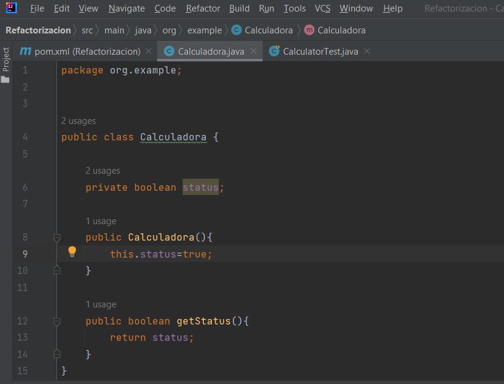

 * Ahora ejecutamos la prueba

  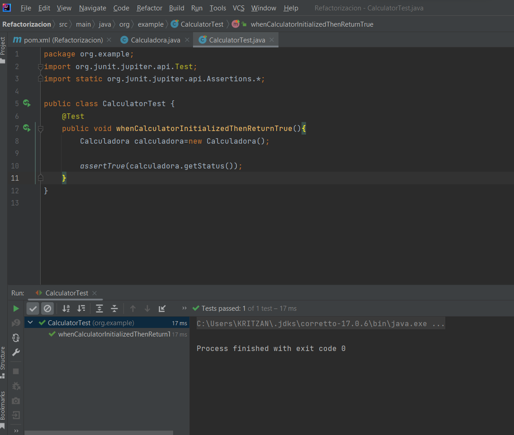

 * Ahora agregramos una prueba para la suma y luego modificamos la clase calculadora y se agrega suma

 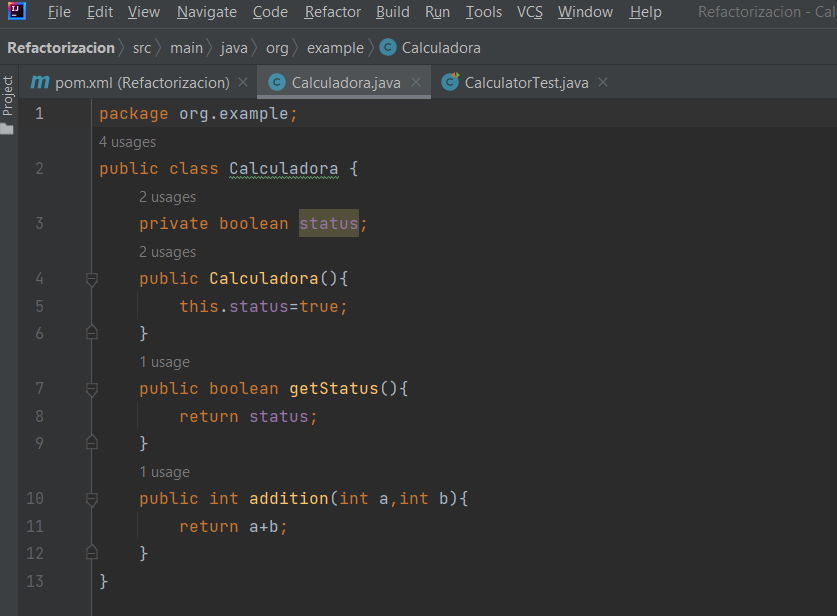

 * Probamos la prueba

 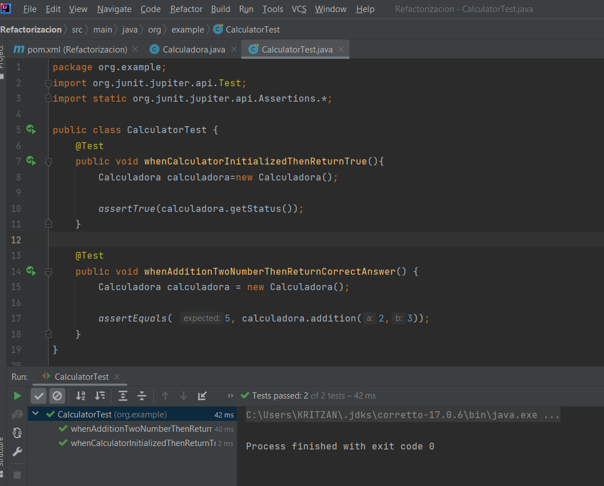

 * Sin embargo se inicializa la clase calculadora en casda metodo lo cual no es una buena idea, asi que procedemos a hacer la rpimera refactorizacion

 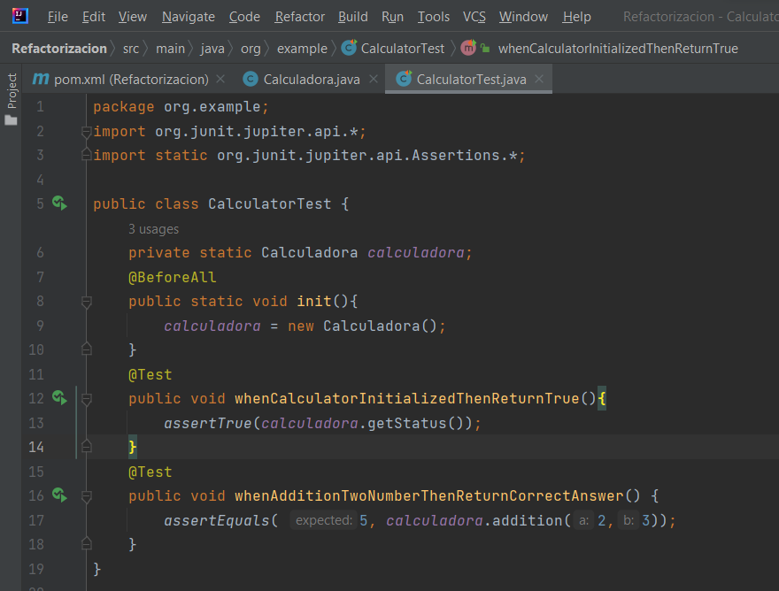

 * Luego procedemos a borrar el codigo de inicializacion de calculadora en los metodos de prueba y probamos la prueba

 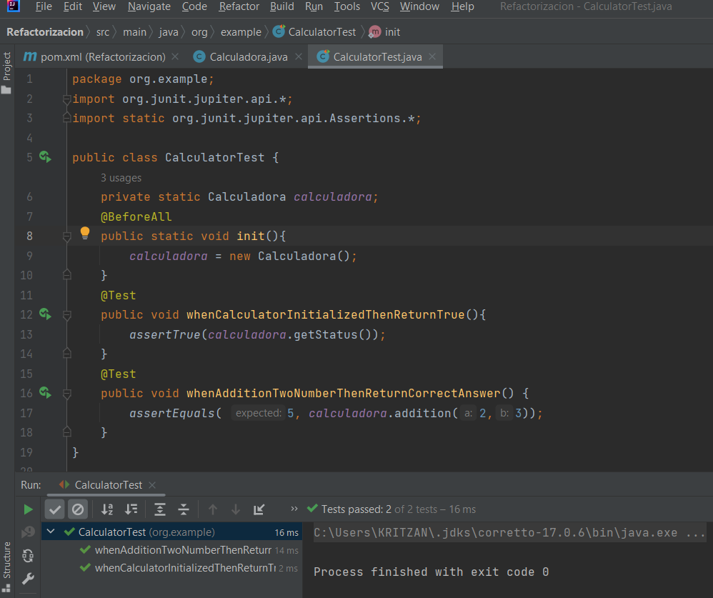
 
 * Agregaremos una prueba para la resta 

 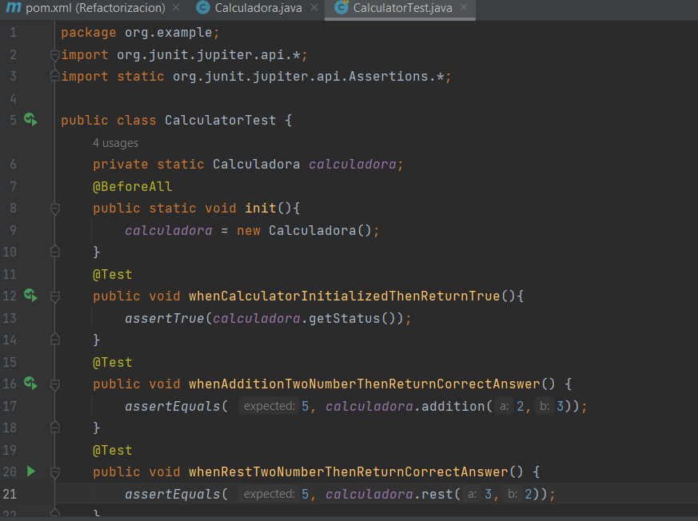

 * Agregamos un metodo de resta en la clase Calculadora

 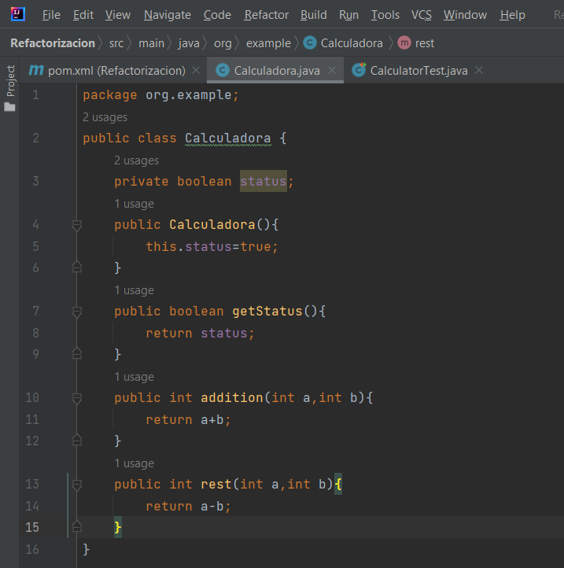

 * Ejecutamos la prueba

 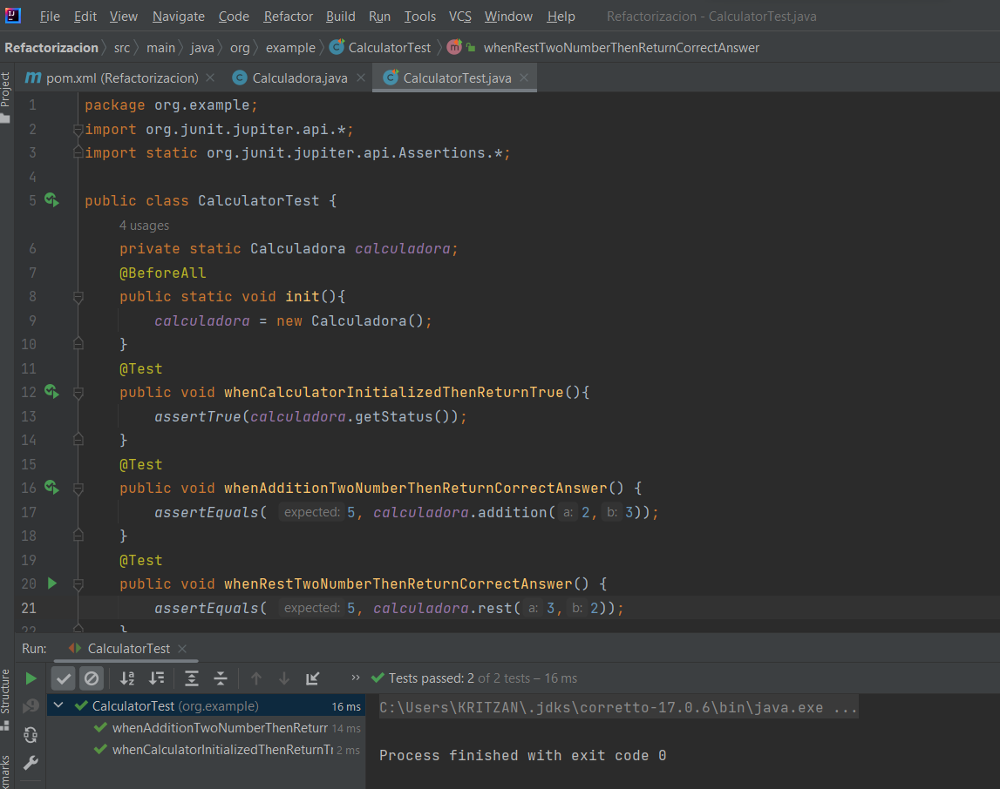

 * Ahora escribimos una prueba para que al dividir por cero lance una excepcion

 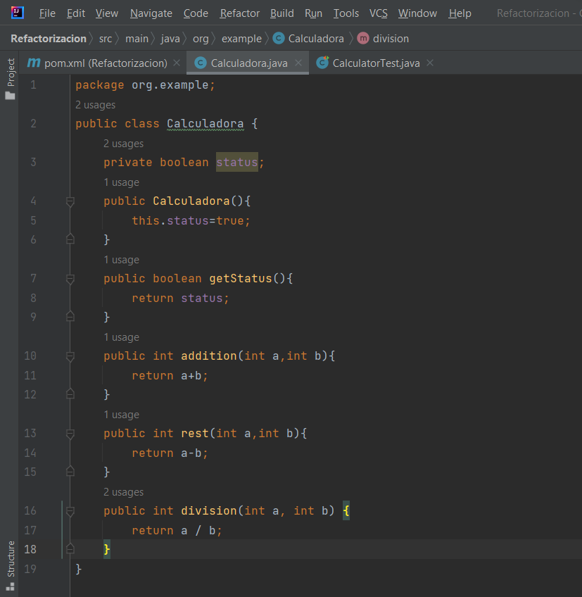

 * e implementamos el metodo en la clase claculadora

 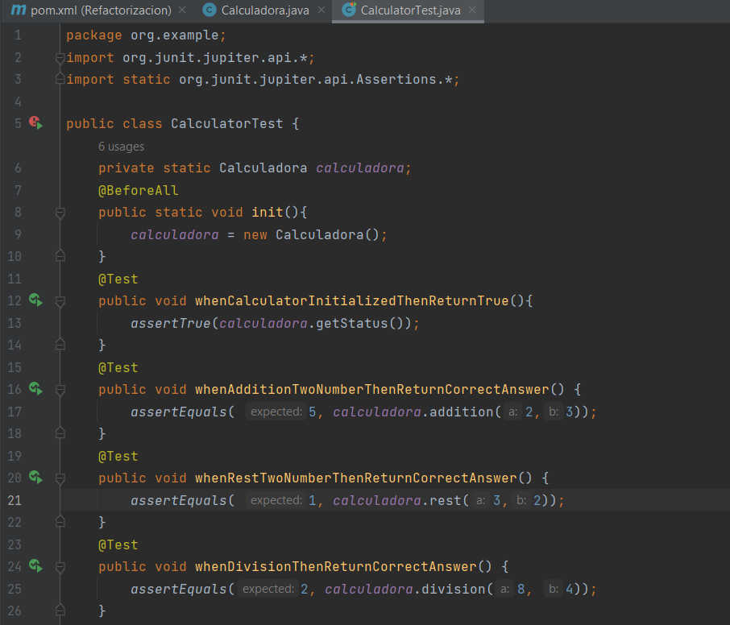

 * Y comprobamos que se lanza una excepcion cuando se divide por cero. Creamos la siguiente prueba

 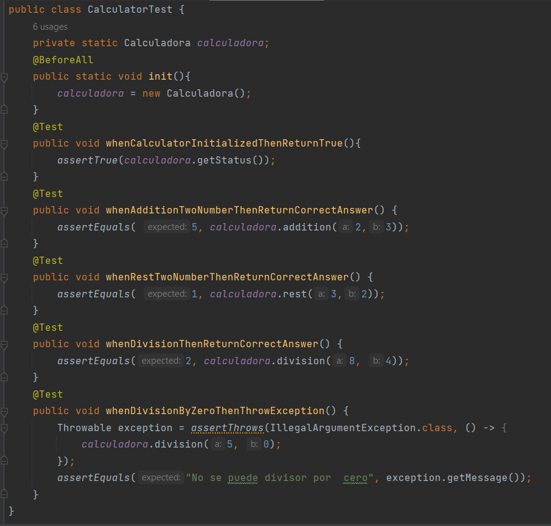

 * luego cambiamos el metodo division en la clase calculadora

 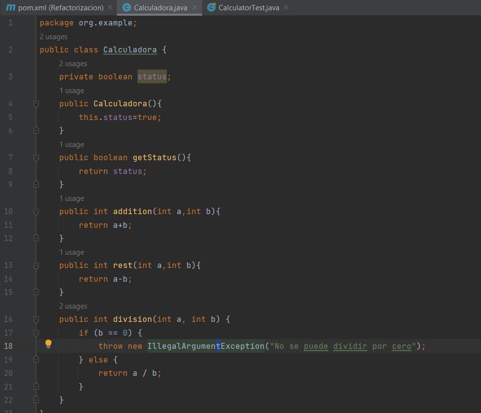

 * y probamos la prueba.

 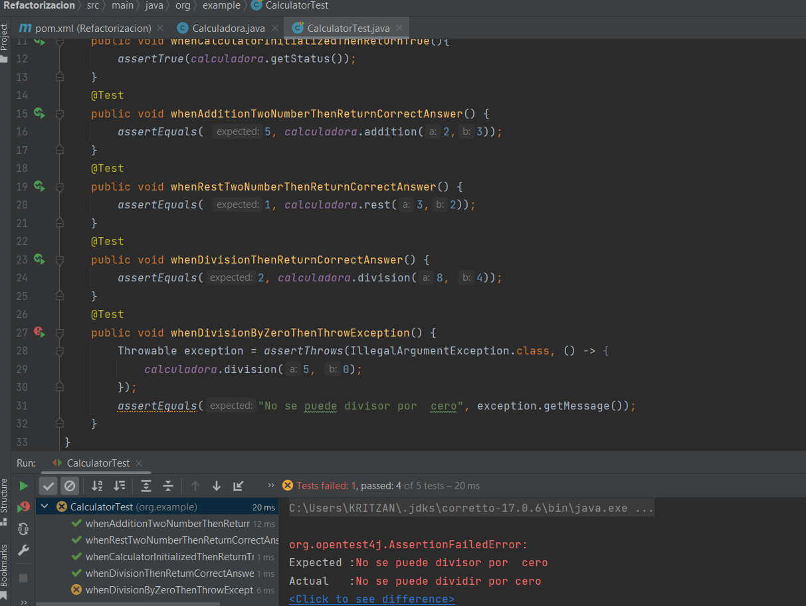

 * 
 

