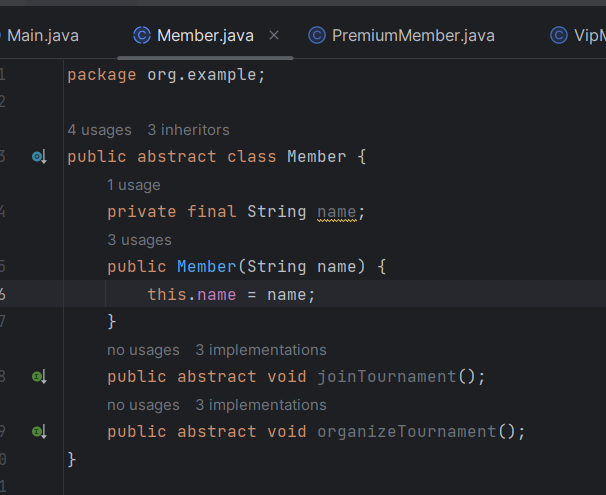
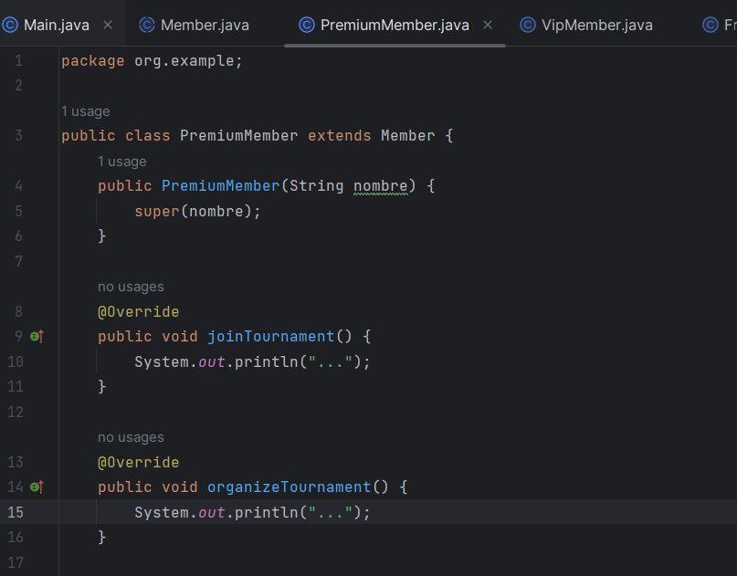
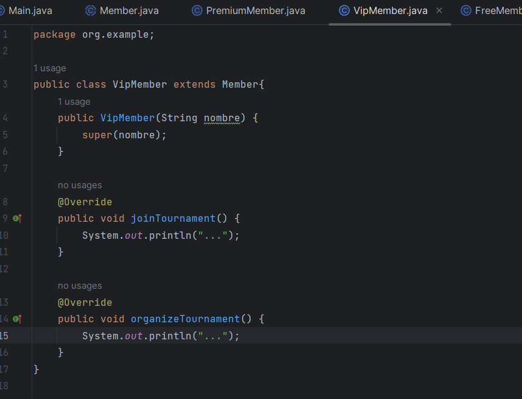
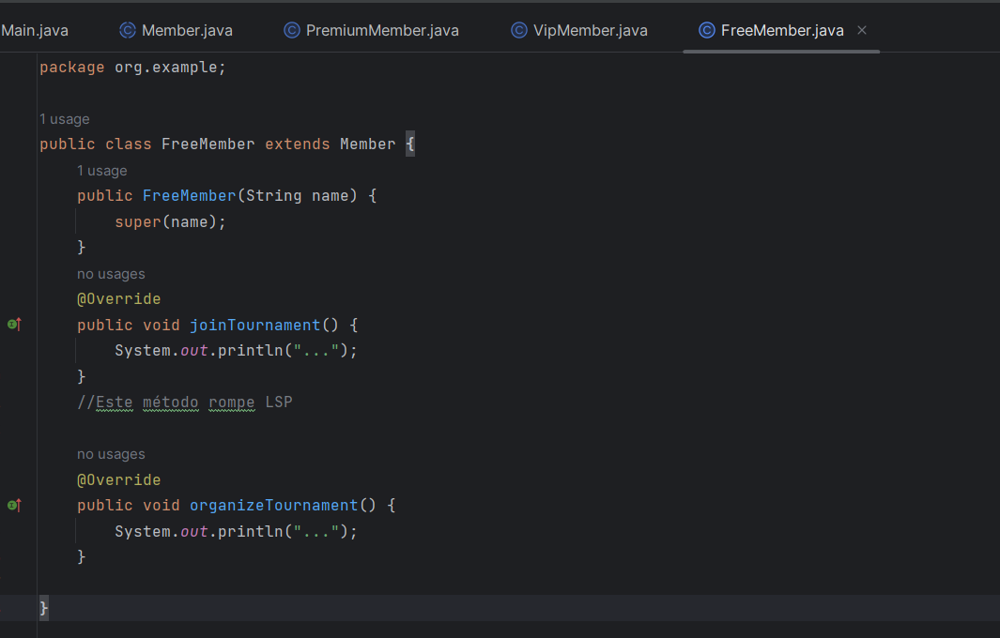
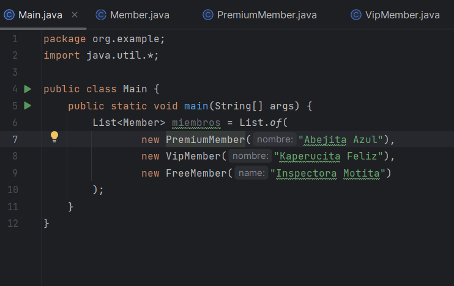
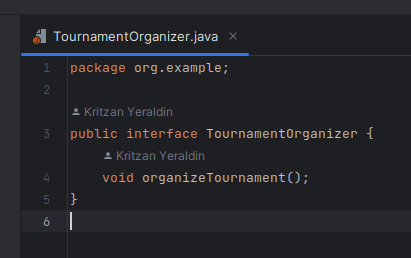
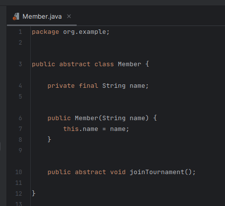

# Examen Parcial
## Pregunta 1 Solid Y refactorizacion
    * Tenemos las clases PremiumMember VipMember y FreeMember
    
 
 
 
 
 

 
 

# Pregunta 3 
## Tomare el Sprint 2 de mi proyecto y realizare RGB
Primero creamos una clase Board

 Ahora lo que queremos es crear un prueba donde el tablero tenga un tamaño valido 3<=n 

El terminal muestra que no existen test por que aun no se implementado tamañoValido. Asi que procedemos a implementar el metodo

