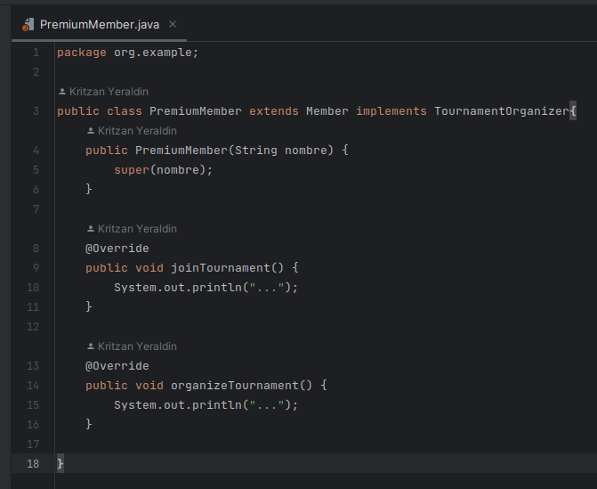
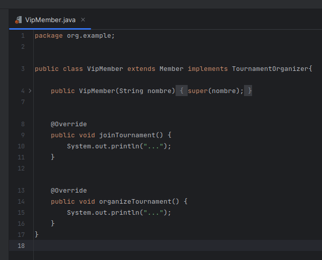
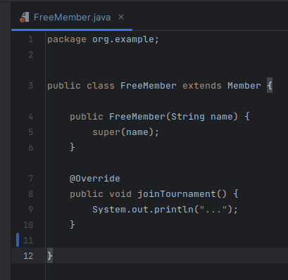

# Examen Parcial

## Pregunta 1 Solid Y refactorizacion

### Antes de refactorizar

Creamos primero la clase `Member` que será abstracta y la cual extenderemos
en nuestras siguientes subclases: `PremiumMember`, `VipMember` y `FreeMember`.

Esta clase `Member` posee un atributo `name` y dos métodos `joinTournament` y
`organizeTournament`.
    

    
Luego creamos nuestras tres clases `PremiumMember`, `VipMember` y `FreeMember`
las cuales extenderán de la clase base `Member` y definirá sus métodos utilizando
el decorador `@Override`.

Pero hay un problema, la clase `FreeMember` no puede organizar torneos, lo cual
significa que no puede definir el método `organizeTournament` (esto rompe LSP).

### Después de refactorizar

Por lo tanto, vamos a cambiar el enfoque. Definiremos la habilidad de organizar
torneos como una interfaz de manera que podamos implementarlo o no en nuestras clases
de forma modular, de la siguiente manera.

Vamos a crear una interfaz llamada `TournamentOrganizer` que declarará el método
`organizeTournament`.

Y ahora vamos a refactorizar nuestra clase `Member`, que solo el atributo `name` y
el método `joinTournament`.

Luego refactorizamos nuestras subclases implementando la interfaz creada donde sea necesaria.

