## Practica Calificada 5

### Pregunta 2
Copiamos el texto del dockerfile de la pregunta 2 y guardamos

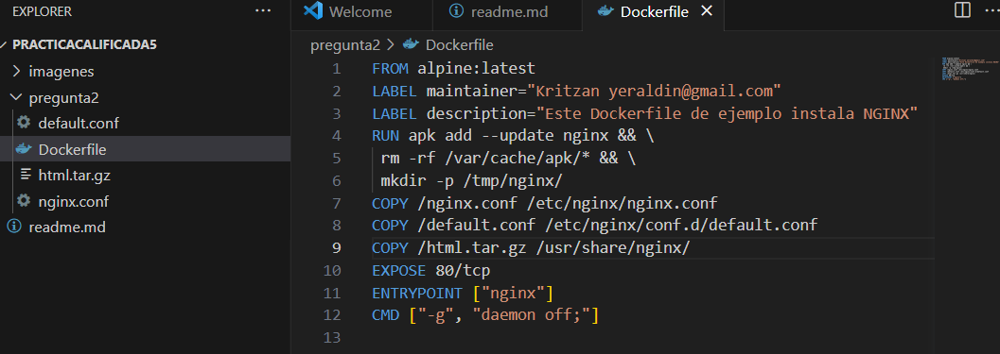

Entramos al cmd y corremos el dockerfile para poder contruir la imagen de alpine. Para comprobar si se creo correctamente escribimos el comando
```(powersheell)
docker images
```

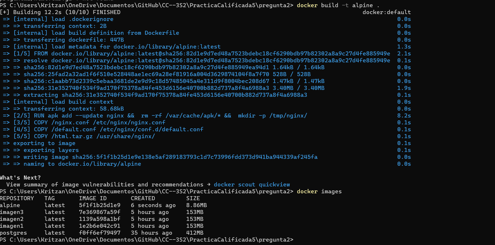

Corremos un contenedor con la imagen creada. Y comprobamos si esta corriendo con 
```(powersheell)
docker ps
```

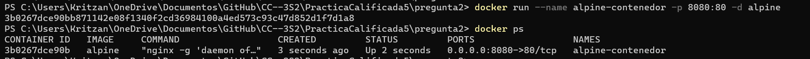

Si ingresamos a http://localhost:8080/ nos muestra lo siguiente

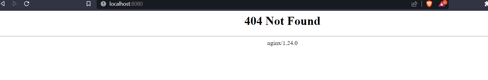

a

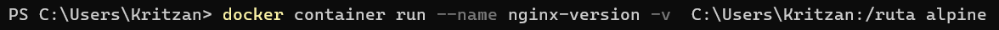
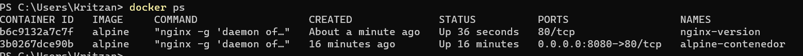

a

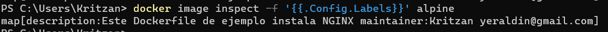

Ahora descargaremos una imagen de docker hub. En este caso sera la de alpine la ultima version que se tenga. Comprobamos si se ha creado la imagen

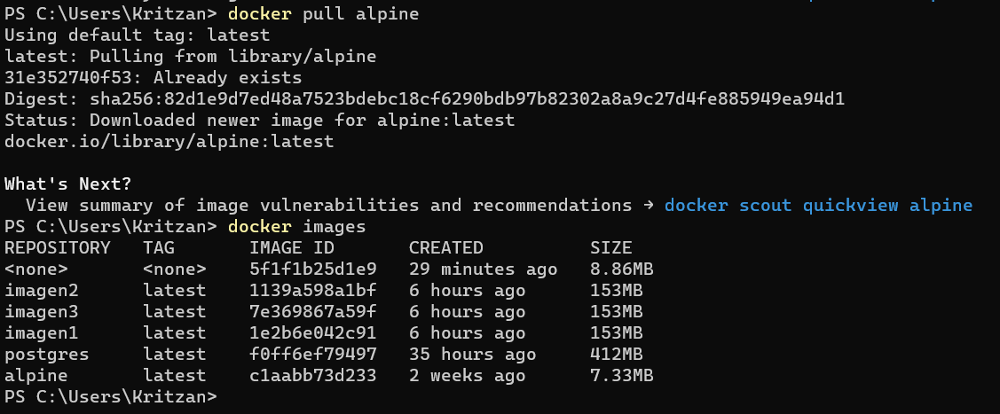

Luego creamo un contenedor de nombre alpine-test e ingresamos a el con -it /bin/sh. Y ejecutamos ciertos comandos que instalaran NGINX

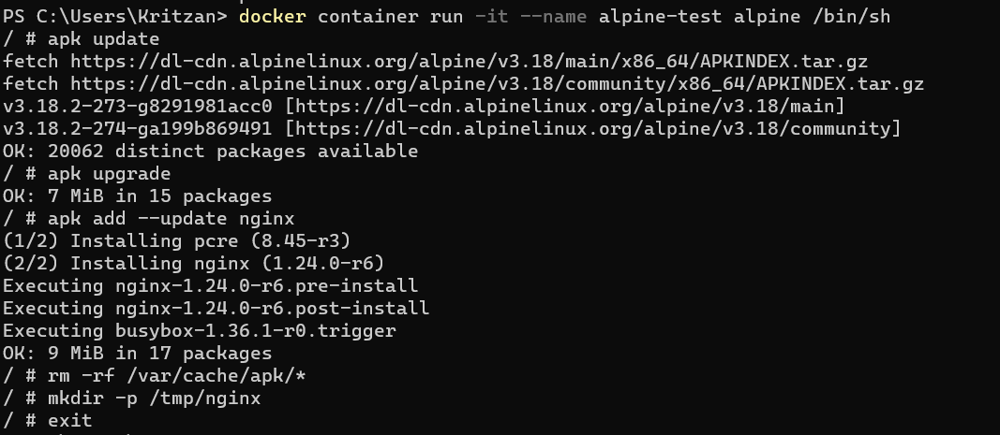

Ejecutamos la siguiente linea la cual detiene el contenedor alpine-test y crea una imagen de el con el nombre my-repo

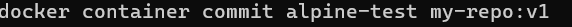

Verificamos si se creo la imagen

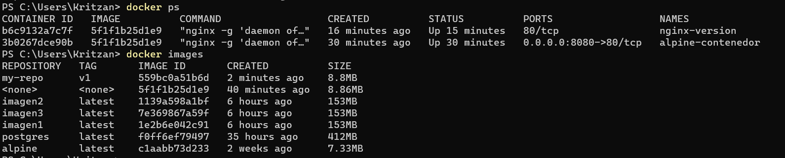

Luego lo guardamos la imagen 

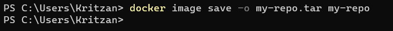

Ahora crearemos un nuevo dockerfile para crear la imagen de alpine desde scratch

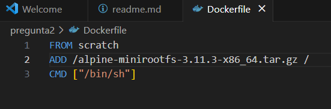

Construimos la imagen a partir del dockerfile y comprobamos si se creo correctamente

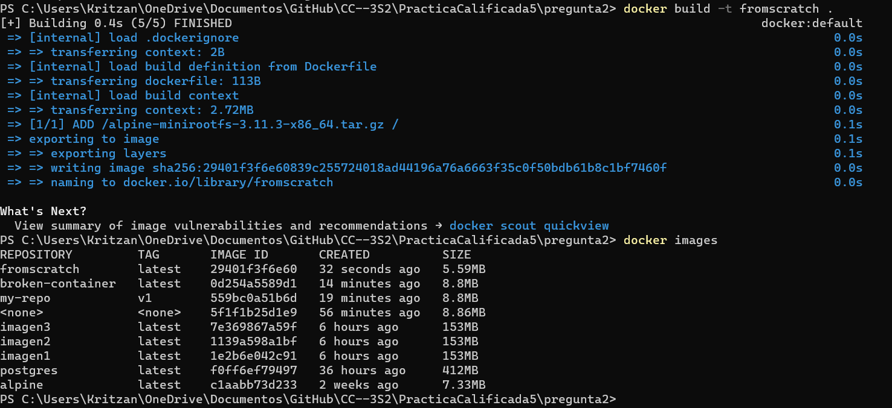

Podemos observar que pesa menos que la imagen creada anteriormente la cual se llama alpine

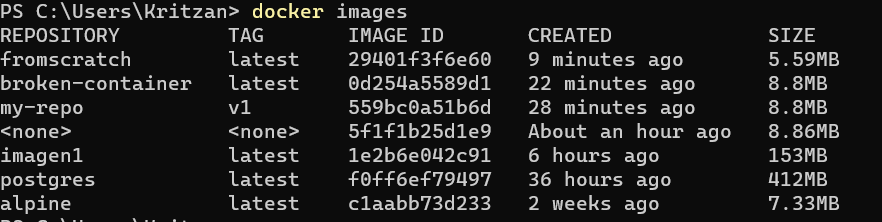

Finalmente, creamos un contenedor con la imagen fromscratch e ingresamos a ella con -it 

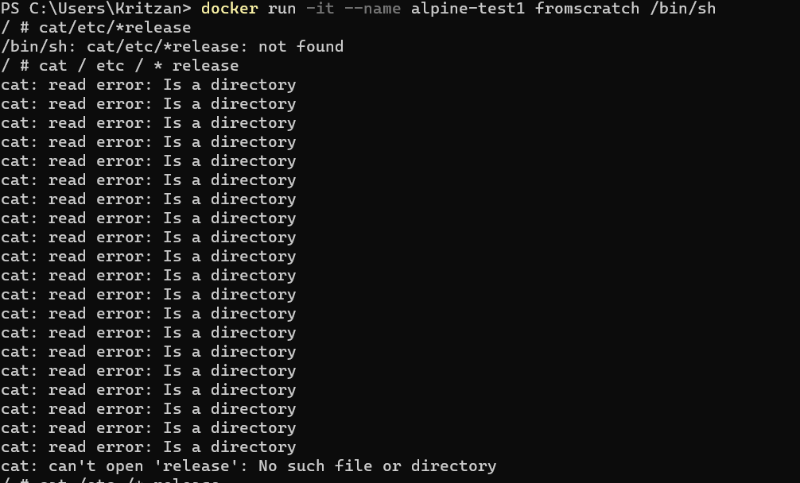


### Pregunta 3

Ingresamos a https://start.spring.io/ y selecionamos los datos agregamos la dependecia de Spring Web y generamos el proyecto el cual se descargara en un archivo ZIP lo descomprimimos y abrimos el archivo con intellij 

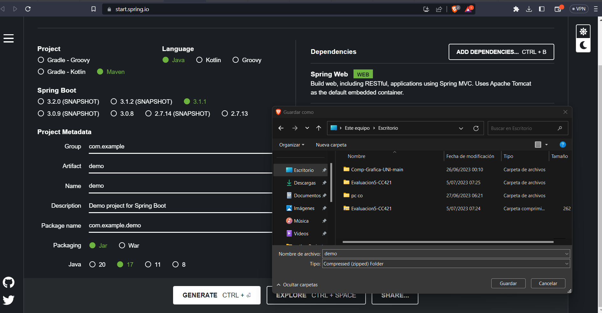

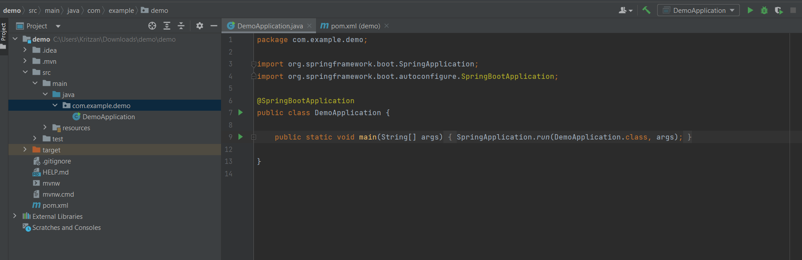

Checamos la depencia en el pom.xml

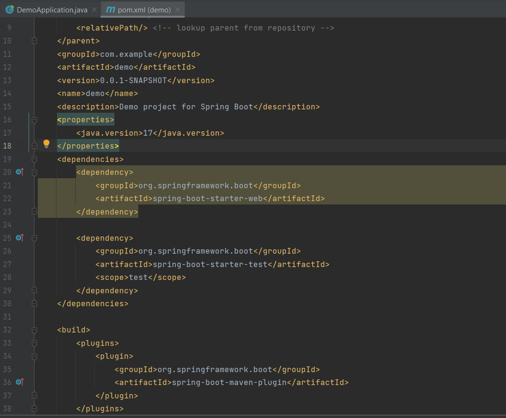

### parte 1

Comenzamos creando la clase ControladorBase de la siguiente forma

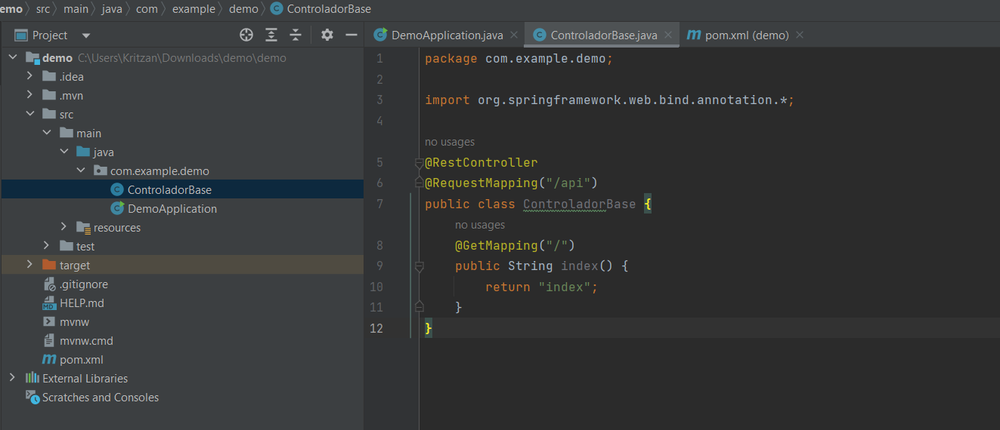


¿Qué crees que significan @Get Mapping @Controller, index?
@RestController: Nos indica que la clase es un controlador REST, o sea respondera a solicitudes HTTP y devolvera datos en formato xml o Json en lugar de html como se solia hacer  

@Get Mapping: Nos indica que el metodo index() hara manejo de las solicitudes HTTP GET a la ruta que se le especifica en este caso '/'
 
 index: Es el metodo que realiza la solicitud get a la ruta "/api". El cual devuelve el texto "index"
 

Corremos el codigo principal 

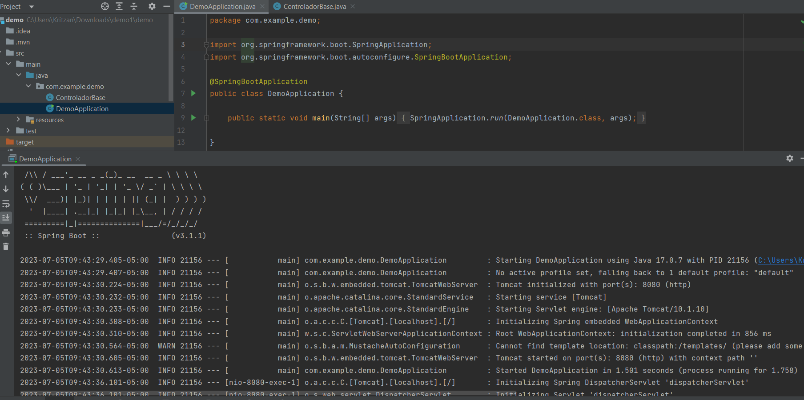

Ahora ingresamos a http://localhost:8080/ y nos deberia aparecer el texto "index"


Ahora generamos un nuevo proyecto agregando la dependencia Mustache

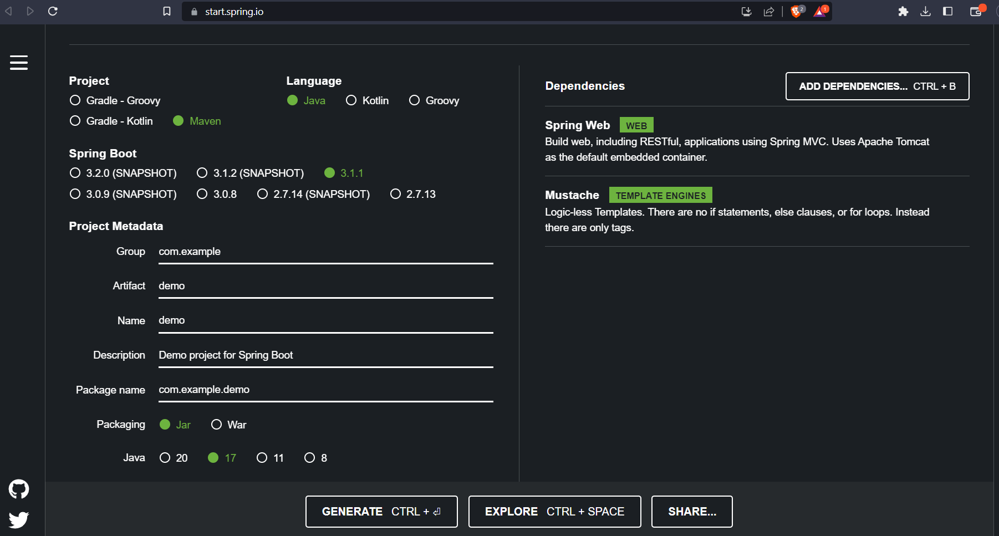

Abrimos el archivo en intellij y nos fijamos las dependencias en el pom.xml

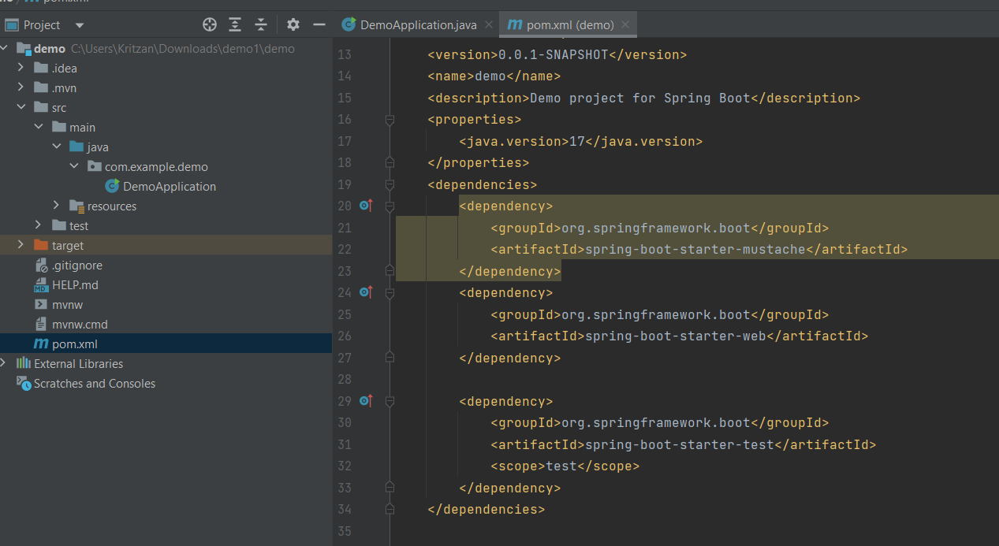

## parte 2

Creamos el archivo index.mustache en el apartado de /templates del proyecto

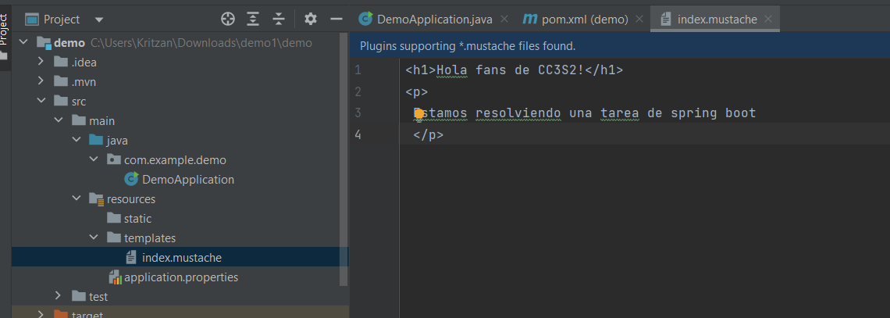

Luego procedemos a correr el proyecto 

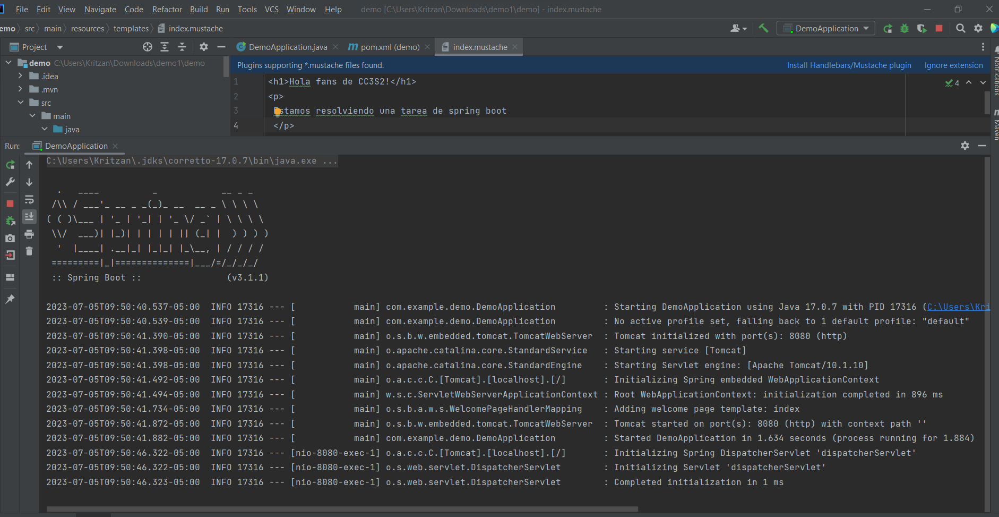

Ingresamos a http://localhost:8080/ nuevamente y se debe mostrar la plantilla creada

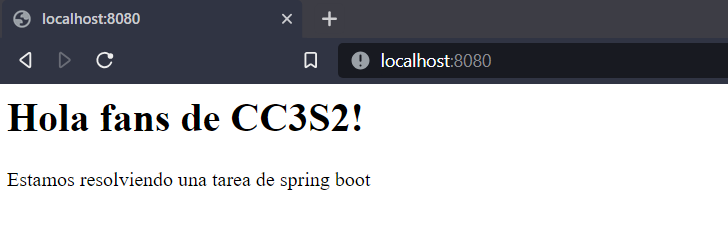


