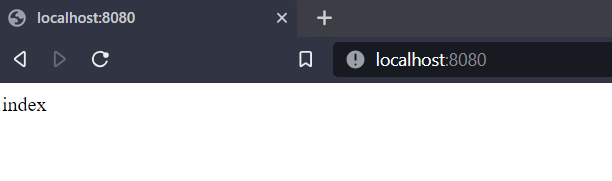

## Practica Calificada 5

### Pregunta 2
Copiamos el texto del dockerfile de la pregunta 2 y guardamos


Entramos al cmd y corremos el dockerfile para poder contruir la imagen de alpine. Para comprobar si se creo correctamente escribimos el comando
```(powersheell)
docker images
```


Corremos un contenedor con la imagen creada. Y comprobamos si esta corriendo con 
```(powersheell)
docker ps
```


Si ingresamos a http://localhost:8080/ nos muestra lo siguiente


Ahora creamos un contenedor con l aimagen creada con volumen 


y si quisieramos saber lo que contiene la etiqueta config.label ejecutamos docker inspect


Ahora descargaremos una imagen de docker hub. En este caso sera la de alpine la ultima version que se tenga. Comprobamos si se ha creado la imagen


Luego creamo un contenedor de nombre alpine-test e ingresamos a el con -it /bin/sh. Y ejecutamos ciertos comandos que instalaran NGINX


Ejecutamos la siguiente linea la cual detiene el contenedor alpine-test y crea una imagen de el con el nombre my-repo


Verificamos si se creo la imagen


Luego lo guardamos la imagen 


Ahora crearemos un nuevo dockerfile para crear la imagen de alpine desde scratch


Construimos la imagen a partir del dockerfile y comprobamos si se creo correctamente


Podemos observar que pesa menos que la imagen creada anteriormente la cual se llama alpine


Finalmente, creamos un contenedor con la imagen fromscratch e ingresamos a ella con -it 


### Pregunta 3

Ingresamos a https://start.spring.io/ y selecionamos los datos agregamos la dependecia de Spring Web y generamos el proyecto el cual se descargara en un archivo ZIP lo descomprimimos y abrimos el archivo con intellij 


Checamos la depencia en el pom.xml


### parte 1

Comenzamos creando la clase ControladorBase de la siguiente forma


¿Qué crees que significan @Get Mapping @Controller, index?
@RestController: Nos indica que la clase es un controlador REST, o sea respondera a solicitudes HTTP y devolvera datos en formato xml o Json en lugar de html como se solia hacer  

@Get Mapping: Nos indica que el metodo index() hara manejo de las solicitudes HTTP GET a la ruta que se le especifica en este caso '/'
 
 index: Es el metodo que realiza la solicitud get a la ruta "/api". El cual devuelve el texto "index"
 

Corremos el codigo principal 


Ahora ingresamos a http://localhost:8080/ y nos deberia aparecer el texto "index"



Ahora generamos un nuevo proyecto agregando la dependencia Mustache


Abrimos el archivo en intellij y nos fijamos las dependencias en el pom.xml


## parte 2

Creamos el archivo index.mustache en el apartado de /templates del proyecto


Luego procedemos a correr el proyecto 


Ingresamos a http://localhost:8080/ nuevamente y se debe mostrar la plantilla creada


Modificamos el archivo ControladorBase de la siguietne forma


Antes de correr el proyecto agregaremos una dependencia al pom.xml llamada thymeleaf. Luego cargamos de nuevo el proyecto e importamos en la clase ControladorBase la libreria que permite el uso de Model


Ahora si corremos el proyecto y no deberia salir errores


Ingresamo a http://localhost:8080/ nuevamente y nos aparece el texto que se retorna en el metodo index


Agregamos codigo a index.mustache


### Parte3

Ejecutamos el proyecto nuevamente


Ingresamos a http://localhost:8080/ nuevamente y nos aparece el texto que se retorna en el metodo index. En este caso modifique el codigo para que retornara model.toString()


## Parte 4

Vamos a proceder a crear clases para cada controlador. 
Primero crearemos la clase Video


## Parte 5

Luego creamos una clase VideoServices en la cual se creara una lista de Videos


## Parte 6 y Parte 7

Actualizamos la clase de ControladorBase para comenzar a usar la nueva clase que creamos.
Se creo una variable de clase VideoServices y se usa @Autowired para inyectar una dependecia en este caso la variable VideoServices en el constructor de la clase ControladorBase


Como notamos tambien se actualiza el metodo index. Cambiamos el tipo a ModelandView y retornamos el mapeo de los videos que hay en la lista videos aplicando la plantilla index


Ahora procedemos a ejecutar el proyecto e Ingresamos a http://localhost:8080/ para ver el listado de los videos


### Parte 8
Agregamos lo siguiente a index.mustache


### Parte 9
Escribimos un nuevo metodo el cual llama a newVideo de la clase VideoServices


y llamamos a ese metodo en nuevo video. Procedemos a correrlo


Al correr el proyecto nos sale un formulario en el cual podemos ingresar el nuevo video


Pero al apretar el boton de submit vemos que aparece un error 


El error que se genera en consola es UnsupportedOperationException.


Este error se produce ya que la lista que se esta usando es List.of

### Parte 10
 Vamos a crear una clase crear de tipo Video, dentro de esta se crea una lista extend que es una copia de la lista de videos existente y agregaremos a ella un nuevo video luego se crea una lista inmutable basada en extend que es asignado a videos y lo retornamos

 

 Luego modificamos la clase ControladorBase en PostMapping  nuevo video para que se agregue el video que ingresaremos en el form y nos redireccione a "/" en la cual se muestra la lista de videos actualizada

  

Ejecutamos el proyecto e ingresamos a http://localhost:8080/


Ingresamos nuevo video en el form y apretamos el boton el cual guarda el nuevo video y nos redirige a "/" donde se mostrara la lista actualizada


Creamos una clase ControladorApi en cual trabajaremos sin plantillas. Creamos una variable privada de tipo VideoService y la inicializamos en el constructor luego en el metodo all obtenemos todos los videos en videos.
Estos se deberian mostrar en  http://localhost:8080/api/videos al correr el proyecto


### Parte 11


## PREGUNTA 4

La automatización de infraestructura en la arquitectura de microservicios se refiere a la automatización del proceso de aprovisionamiento, configuración y gestión de la infraestructura necesaria para ejecutar y mantener los microservicios en producción. Se utilizan herramientas y técnicas para automatizar tareas por ejemplo: la creación de máquinas virtuales, la configuración de redes, la gestión de contenedores. Tambien permite gestionar de manera eficiente la infraestructura para admitir tanto implementacion como ejecucion de multiple microservicios idependientemente. Tambien permite una tolerancia a fallos, de esta forma contribuye a la estabilidad del sistema


